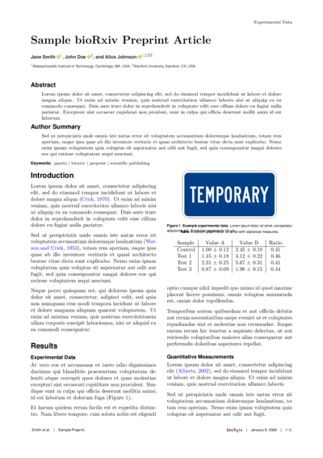
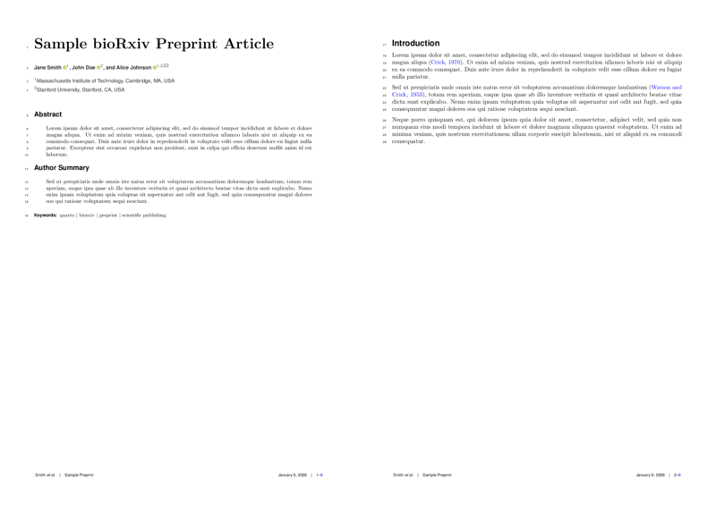

# bioRxiv Quarto Format

Quarto extension for bioRxiv-style preprint manuscripts, based on the LaTeX template from [quantixed/manuscript-templates](https://github.com/quantixed/manuscript-templates).

## Preview

| Two-column (default) | Submission format |
|:---:|:---:|
|  |  |

Sample PDFs: [two-column](examples/template-biorxiv-pdf.pdf) | [submission](examples/template-biorxiv-submit.pdf)

## Features

### Original Template Features

- Two-column bioRxiv preprint layout
- Single-column submission format with line numbers
- Author affiliations with superscript numbering
- ORCID integration
- bioRxiv logo in footer
- natbib citation support with author-year style
- Proper SI units support via siunitx

### Quarto Extension Features

- In-document abstract and author summary parsing
- Abstract spanning across columns in two-column mode
- Column-spanning figures via `fig-env` attribute
- Customizable footer logo and date
- Single-column mode via class options
- Cross-format compatibility (HTML, DOCX, PDF)

## Installation

### Add to Existing Project

```bash
quarto add ja-mf/quarto-biorxiv
```

### Create New Project

```bash
quarto use template ja-mf/quarto-biorxiv
```

## Usage

### Basic Setup

```yaml
---
title: "Your Paper Title"
format:
  biorxiv-pdf: default          # Two-column preprint format
  # biorxiv-pdf:                # Uncomment for submission format:
  #   classoption: [submit]     # Single-column with line numbers
author:
  - name: First Author
    affiliations:
      - ref: inst-a
    orcid: 0000-0001-0000-0000
  - name:
      given: Jane
      family: Smith
    affiliations:
      - ref: inst-b
    corresponding: true
affiliations:
  - id: inst-a
    name: University Name, City, Country
  - id: inst-b
    name: Institute Name, City, Country
keywords:
  - keyword1
  - keyword2
bibliography: references.bib
---

#### Abstract

Your abstract text here.

#### Author Summary

Optional author summary text.

# Introduction

Manuscript content starts here.
```

### Abstract and Keywords

Use `#### Abstract` and `#### Author Summary` headers in the document body. Keywords are specified in YAML metadata and appear after the abstract.

Control abstract column spanning:

```yaml
format:
  biorxiv-pdf:
    abstract-span: false  # Place abstract in left column only
```

### Column Layout

Two-column layout (default):

```yaml
format:
  biorxiv-pdf: default
```

Submission format with line numbers (single-column):

```yaml
format:
  biorxiv-pdf:
    classoption: [submit]
```

Alternative single-column layout without line numbers:

```yaml
format:
  biorxiv-pdf:
    classoption: [onecolumn]
```

### Using the Makefile

The template includes a `Makefile` for easily rendering different formats without modifying your YAML:

```bash
make           # Render two-column format (default)
make twocolumn # Render two-column format  
make onecolumn # Render single-column format
make submit    # Render submission format with line numbers
make all       # Render all three formats
make clean     # Remove generated PDFs
make help      # Show usage information
```

The Makefile automatically detects your `.qmd` file and generates appropriately named PDFs:
- `yourfile-twocolumn.pdf` - Two-column preprint
- `yourfile-onecolumn.pdf` - Single-column
- `yourfile-submit.pdf` - Submission format with line numbers

This is useful for maintaining multiple output formats without switching YAML configurations.

### Column-Spanning Figures

Use the `fig-env` attribute for figures that span both columns:

```markdown
{#fig-id fig-env="figure*"}
```

This attribute is LaTeX-specific and ignored by HTML/DOCX formats.

### Footer Customization

Customize or hide footer elements:

```yaml
---
footer-logo: biorxiv        # Default: bioRxiv logo
footer-logo: "PREPRINT"     # Custom text
footer-logo: false          # Hide logo

footer-date: true           # Default: today's date
footer-date: "January 2026" # Custom date
footer-date: false          # Hide date
---
```

### Class Options

```yaml
format:
  biorxiv-pdf:
    classoption: [onecolumn, watermark]
```

Available options:

| Option | Description |
|--------|-------------|
| `twocolumn` | Two-column layout (default) |
| `onecolumn` | Single-column layout |
| `submit` | Submission mode with line numbers |
| `watermark` | DRAFT watermark on pages |
| `rmabstract` | Non-bold abstract text |
| `bibskip` | Spacing between bibliography entries |

## Template Files

When you use this template, you get:

- `template.qmd` - Example manuscript
- `references.bib` - Example bibliography
- `Figures/` - Directory for figures
- `gitignore-template` - Recommended `.gitignore` file (rename to `.gitignore`)

During rendering, Quarto automatically copies required LaTeX files (`.cls`, `.sty`, `.bst`, logo) to your project directory. These files are needed by LaTeX but can clutter your project. The provided `gitignore-template` excludes them from version control.

**Recommended setup:**
```bash
mv gitignore-template .gitignore
git init
git add .
git commit -m "Initial commit"
```

## Credits

This Quarto extension ports the LaTeX template from [quantixed/manuscript-templates](https://github.com/quantixed/manuscript-templates), originally forked from RoyleLab-StyleBioRxiv and zHenriquesLab-StyleBioRxiv.

## License

GPL-3.0

## How It Works

This extension uses Quarto's Lua filter system to process your document before LaTeX compilation:

1. **Abstract parsing** (`abstract.lua`): Extracts `#### Abstract` and `#### Author Summary` sections from your document body and converts them to LaTeX abstract environments. In two-column mode, the abstract spans both columns by default using `\twocolumn[...]` commands.

2. **Footer customization** (`footer-options.lua`): Processes `footer-logo` and `footer-date` YAML options, generating LaTeX commands to customize or hide footer elements.

3. **Main orchestration** (`main.lua`): Coordinates the filter execution order, ensuring footer commands are inserted before abstract processing.

The filters run automatically when you render your document—you don't need to invoke them manually. All configuration is done via YAML frontmatter.
